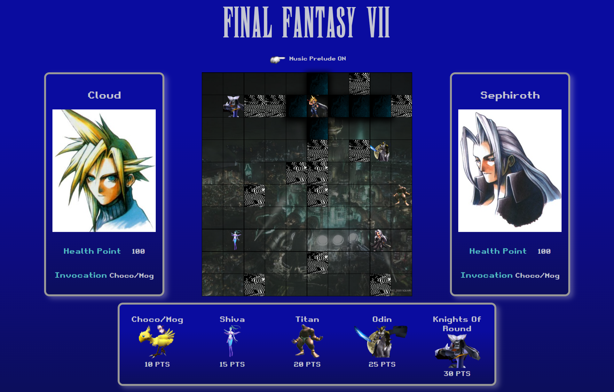

# OpenClassrooms Projet 6, Créez un jeu de plateau tour par tour en JS

## Les consignes

Ce projet consistera à créer un jeu en ligne en JavaScript dans lequel 2 joueurs évoluent chacun leur tour pour s'affronter. Comme dans Highlander, il ne peut en rester qu'un !

### Etape 1 : génération de la carte

Commencez par générer aléatoirement la carte du jeu. Chaque case peut être soit :

- Vide
- Inaccessible (grisée)

Sur la carte, un nombre limité d’armes (4 maximum) sera placé aléatoirement et pourra être récolté par les joueurs qui passeraient dessus.

Vous inventerez au moins 4 types d’arme dans le jeu, avec des dégâts différents. L’arme par défaut qui équipe les joueurs doit infliger 10 points de dégâts. Chaque arme a un nom et un visuel associé.

Le placement des deux joueurs est lui aussi aléatoire sur la carte au chargement de la partie. Ils ne doivent pas se toucher (ils ne peuvent pas être côte à côte).

### Etape 2 : les mouvements

A chaque tour, un joueur peut se déplacer d’une à trois cases (horizontalement ou verticalement) avant de terminer son tour. Il ne peut évidemment pas passer à travers un obstacle.

Si un joueur passe sur une case contenant une arme, il laisse son arme actuelle sur place et la remplace par la nouvelle.

### Etape 3 : le combat !

Si les joueurs se croisent sur des cases adjacentes (horizontalement ou verticalement), un combat à mort s’engage.

Lors d'un combat, le fonctionnement du jeu est le suivant :

- Chacun attaque à son tour
- Les dégâts infligés dépendent de l’arme possédée par le joueur
- Le joueur peut choisir d’attaquer ou de se défendre contre le prochain coup
- Lorsque le joueur se défend, il encaisse 50% de dégâts en moins qu’en temps normal
- Dès que les points de vie d’un joueur (initialement à 100) tombent à 0 , celui-ci a perdu. Un message s’affiche et la partie est terminée.

## Technologies utilisées

- Orienté objet
- JS natif
- Jquery
- Sass